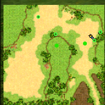

# monster.dat

That file contains list of all monsters configuration.
This file format is simillar to [Item.dat](./Item_dat) (both files can be edit using simple text file editors).

## Example

```txt title="monster.dat"
#========================================================
	VNUM	0
	NAME	zts1e
	LEVEL	16
	RACE	0	1	0
	ATTRIB	0	0	13	0	1	0
	HP/MP	0	0
	EXP	0	0
	PREATT	0	0	8	8	400
	SETTING	0	0	-1	0	0	0
	ETC	8	1	0	0	0	0	0	0
	PETINFO	1	10	0	50	1
	EFF	200	0	0
	ZSKILL	0	1	3	2	12	0	0
	WINFO	0	0	0
	WEAPON	16	1	0	0	0	11	-20
	AINFO	0	0
	ARMOR	16	0	-25	0	0
	SKILL	0	0	0	0	0	0	0	0	0	0	0	0	0	0	0
	PARTNER	0	0	0	0	0	0	0	0	0	0	0	0	0	0	0	0	0	0	0	0
	BASIC	0	0	4	0	0	0	0	0	0	0	0	0	0	0	0	0	0	0	0	0	0	0	0	0	0	0	0	0	0	0	0	0	0	0	0	0	0	0	0	0	0	0	0	0	0	0	0	0	0	0
	CARD	0	0	0	0	0	0	0	0	0	0	0	0	0	0	0	0	0	0	0	0
	MODE	0	0	0	0	0	0	0	0	0	0	0	0	0	0	0	0	0	0	0	0	0	0	0	0	0	0	0	0	0	0	0	0
	ITEM	2000	9000	1	16	800	1	-1	0	0	-1	0	0	-1	0	0	-1	0	0	-1	0	0	-1	0	0	-1	0	0	-1	0	0	-1	0	0	-1	0	0	-1	0	0	-1	0	0	-1	0	0	-1	0	0	-1	0	0	-1	0	0	-1	0	0	-1	0	0
#========================================================
```

## Notes

- That file never use spaces, **only tabs**.
- Each section is separated using `#======...`.

## Format

```txt title="monster.dat"
#========================================================
	VNUM	{monsterVnum}
	NAME	{monsterCodeName}
	LEVEL	{monsterLevel}
	RACE	{raceType}	{raceSubType}	{monsterHeroLevel}
	ATTRIB	{monsterElement}	{monsterElementRate}	{monsterResistanceFire}	{monsterResistanceWater}	{monsterResistanceLight}	{monsterResistanceDark}
	HP/MP	{monsterMaxHpBonus}	{monsterMaxMpBonus}
	EXP	{monsterXpBonus}	{monsterJobXpBonus}
	PREATT	{hostility}	{groupAttack}	{seekRange}	{movementSpeed}	{respTime}
	SETTING	{iconID}	{spawnMobOrColor}	{amountOrItem}	{spriteSize}	{cellSize}	{unknown0, always 0}
	ETC	{bitFlags}	{unknown1}	{isPercentileDmg}	{canOnlyBeDmgedByJajamaruLastSkill}	{unknown2, always 0}	{visibleOnMinimapAsGreenDot}	{unknown3}	{isValhallaPartner}
	PETINFO	{val1}	{val2}	{val3}	{val4}	{val5}
	EFF	{effIdOnAttack}	{effIdConstantly}	{effIdOnDeath}
	ZSKILL	{attType}	{range}	{hitChance}	{castTime}	{cooldown}	{dashSpeed}	{unknown4}
	WINFO	{attType}	{unknown5}	{grade}
	WEAPON	{lvl}	{range}	{dmgMin}	{dmgMax}	{hitRate}	{critChance}	{critDmg}
	AINFO	{defType}	{grade}
	ARMOR	{lvl}	{meleeDef}	{rangedDef}	{magicDef}	{dodge}
	SKILL	{vnum}	{chance}	{force}	[4 times the same thing]
	PARTNER	0	0	0	0	0	0	0	0	0	0	0	0	0	0	0	0	0	0	0	0
	BASIC	{BCardVNUM}	{EffectVal_1}	{EffectVal_2}	{BCardSub}	{Target}	[9 times the same thing]
	CARD	{BCardVNUM}	{EffectVal_1}	{EffectVal_2}	{BCardSub}	{Target}	[3 times the same thing]
	MODE	{BCardVNUM}	{EffectVal_1}	{EffectVal_2}	{BCardSub}	{Target}	[4 times the same thing]	{alwaysActive}	{limiter}	{hpThreshold/itemVnum}	{modeRangeTreshold}	{c_modeVnum}	{cellMinRange}	{midgard}
	ITEM	{itemVNUM}	{chance}	{amount}	[19 times the same thing]
#========================================================
```

:::warning

Its important to remember that **values are separated by tabs, not spaces.**

_Visual Studio Code_ replaces tabs with spaces by default.
Thats why recommended is to use _Notepad++_ or other text editor who will not replace tabs with spaces.

:::

### VNUM

```txt
	VNUM	{monsterVnum}
```

Monster VNum (You can create multiple monsters with the same model. For example Fox with id: 0, 1, 2) |

### NAME

```txt
	NAME	{monsterCodeName}
```

- `{monsterCodeName}` contains the key for translation.
  For example `zts3e` is a key for translation.
- Translations can be found in `_code_<lang>_<filetype>.txt` files (for example `_code_en_monster.txt`).
- If you will specify wrong zts value (translation) it will display that zts value
  (for example `zts3e`) in game.
- Simillar to [Item.dat Name](./Item_dat#name-and-linedesc)

### LEVEL

```txt
	LEVEL	{monsterLevel}
```

self-explanatory

### RACE

```txt
	RACE	{raceType}	{raceSubType}	{monsterHeroLevel}
```

#### Get race name ID

$$
\text{raceId} = 300 + \text{raceType} \times 10 + \text{raceSubType} + 7
$$

Use that id in `conststring.dat` to get race name (or check the list at the bottom)

<details>
  <summary>List of races</summary>

    - 0/0 - low level plants
    - 0/1 - low level animals
    - 0/2 - low level monsters
    - 1/0 - high level plants
    - 1/1 - high level animals
    - 1/2 - high level monsters
    - 2/0 - kovolt
    - 2/1 - bushtail
    - 2/2 - catsy
    - 3/0 - human
    - 3/2 - neutral
    - 3/3 - demon
    - 4/0 - angel
    - 5/0 - low level undead
    - 5/1 - high level undead
    - 6/0 - low level spirit (a5.1 mobs)
    - 8/0 - fixed trap - these traps on raids that hit you from nowhere, etc.
    - 8/1 - energy ball - sp3a bombs, mini-clones from hongbi&cheongbi
    - 8/2 - cannon ball - rainbow battle crystals
    - 8/3 - talkable npc - like TS sign, ML sign, SP stones
    - 8/4 - generic, a lot of different ones here
    - 8/5 - teleporters
    - 8/6 - quest mob spawner
    - 8/7 - collectibles (like ice flowers)
    - 8/8 - a5 quest collectibles (or something, idk)

</details>

#### Obtaining race icon ID

$$
\text{raceIconId} = 18000 + \text{raceType} \times 50 + \text{raceSubType}
$$

Icons are located in the `NSipData.NOS` file

:::warning

Monsters with `raceType` == `8` **MUST NEVER BE ABLE TO USE BASIC ATTACKS** (they can use skills if they have any), and **MUSTNOT BE TARGETABLE BY AoE's**.

:::

### ATTRIB

```txt
	ATTRIB	{monsterElement}	{monsterElementRate}	{monsterResistanceFire}	{monsterResistanceWater}	{monsterResistanceLight}	{monsterResistanceDark}
```

### HP/MP

```txt
	HP/MP	{monsterMaxHpBonus}	{monsterMaxMpBonus}
```

### EXP

```txt
	EXP	{monsterXpBonus}	{monsterJobXpBonus}
```

### PREATT

```txt
	PREATT	{hostility}	{groupAttack}	{seekRange}	{movementSpeed}	{respTime}
```

#### `hostility`

- 1 - Attacks when it sees you
- 4 - Attacks pets (nosmate trainers)
- 23 - Attacks devils (guardians in a4)
- 24 - Attacks angels (guardians in a4)
- 100 - Attacks if you are not wearing Phantom's Amulet 
- If > 20000: atttacks while doing quest with VNUM (hostility-20000) (hostility 25278 would be quest 5278)

#### `groupAttack`

- If 1: with others (when a mob attacks you, his allies will also attack you if you're in their seek range (kovolts))
- If 5: with group (if you attack this mobs, his allies will also attack you if you're in their seek range (wolves, pigeons))

#### `seekRange`

#### `movementSpeed`

#### `respTime`

Is in deciseconds (so value 100 would be 10 seconds)

### SETTING

```txt
	SETTING	{iconID}	{spawnMobOrColor}	{amountOrItem}	{spriteSize}	{cellSize}	{unknown0, always 0}
```

#### iconID

Is avatar inside `NSipData.NOS` (example: </img>)

#### spawnMobOrColor / amountOrItem

<table>
  <tr>
    <th>Mode</th>
    <th>Colors</th>
    <th>More monsters</th>
  </tr>
  <tr>
    <th>`hostility` value</th>
    <td>0 - 19999</td>
    <td>20000 - ...</td>
  </tr>
  <tr>
    <th>Behaviour</th>
    <td>
      * This mob can have a custom color (if `spawnMobOrColor` is not 0)
      * It's an int representation of the RGBA color (value -12477399 in hex is 0xff419c29, and so the RGBA is #ff419c29 (0xff red, 0x41 green, 0x9c blue, 0x29 alpha))
      * You can use our [Color calculator](/color-calculator) to get color int value
    </td>
    <td>
      This mob spawns `amountOrItem`x [MOB:`spawnMobOrColor`]
    </td>
  </tr>
  <tr>
    <th>Examples</th>
    <td>
      * Invisible Jelly 
      * Invisible Dust King 
      * Angry Chicken 
    </td>
    <td>
     * Laboratory Observer (Vnum: 857)  spawns 3 Mobs: Gaunt Zombie Guard (Vnum: 299) 
    
     Most monsters in this category give the impression that they are used to configure various elements of the game. In fact, they are never visible to the player, dont have sprites and dont have icon.
    </td>
  </tr>
</table>

#### spriteSize

Bonus (positive or negative) sprite size percentage (value `-10` would result in 90% sprite size)

Examples:
* Score Board (Vnum: 915) </img> +10%
* Twisted Ice Worm (Vnum: 764) </img> +90%
* Valakus' Egg (Vnum: 2016) </img> -50%

#### cellSize

Bonus cell size for AoE spells (used for big bosses like Hatus or Caligor)

Examples:
* Wounded Asgobas (Vnum: 1462) </img> cellSize=4
* Lord Hatus (Vnum: 577) </img> cellSize=5

### ETC

```txt
	ETC	{bitFlags}	{unknown1}	{isPercentileDmg}	{canOnlyBeDmgedByJajamaruLastSkill}	{unknown2, always 0}	{visibleOnMinimapAsGreenDot}	{unknown3}	{isValhallaPartner}
```

#### bitFlags

Flags are stored as an integer and calculated using bitwise operations. If you want to dive deeper into what's happening behind the curtains, check the [Wikipedia](https://en.wikipedia.org/wiki/Bit_field) and [MDN](https://developer.mozilla.org/en-US/docs/Web/JavaScript/Reference/Operators) articles on the topic.

<details>
  <summary>Table with bitFlags documentation</summary>
    
    | option | bitFlags | comment |
    |--|--|--|
    | cantWalk | bitFlags & 1 | this mob can't walk |
    | canCollect | bitFlags & 2 | this mob can be collected (ice flowers etc.) but only if it has any Drops, and is placed as NPC, not a mob |
    | cantDebuff | bitFlags & 4 | this mob can't be debuffed |
    | canCatch | bitFlags & 8 | this mob can be caught |
    | disappearAfterSeconds | bitFlags & 16 | this mob will disappear after realHP/10 seconds |
    | disappearAfterHitting | bitFlags & 32 | this mob will disappear after its first hit (mini-inferno) |
    | hasMode | bitFlags & 64 | this mob has MODE |
    | disappearAfterSecondsMana | bitFlags & 128 | this mob will disappear after realMP/10 seconds |
    | onDefenseOnlyOnce | bitFlags & 256 | this mob's "during defense" CARD will trigger only once |
    | hasDash | bitFlags & 512 | this mob uses a dash |
    | canRegenMp | bitFlags & 1024 | (this mob will regenerate HP over time) |
    | cantVoke | bitFlags & 2048 | this mob can't be moved by vokes, repels etc. |
    | | bitFlags & 4096 | always 0? |
    | | bitFlags & 8192 | always 0? |
    | | bitFlags & 16384 | always 0? |
    | | bitFlags & 32768 | always 0? |
    | | bitFlags & 65536 | always 0? |
    | | bitFlags & 131072 | always 0? |
    | | bitFlags & 262144 | always 0? |
    | | bitFlags & 524288 | always 0? |
    | | bitFlags & 1048576 | always 0? |
    | | bitFlags & 2097152 | always 0? |
    | | bitFlags & 4194304 | always 0? |
    | | bitFlags & 8388608 | always 0? |
    | | bitFlags & 16777216 | always 0? |
    | | bitFlags & 33554432 | always 0? |
    | | bitFlags & 67108864 | always 0? |
    | | bitFlags & 134217728 | always 0? |
    | dontDrainHpAfterSeconds | bitFlags & 268435456 | this mob won't lose HP but will stil disappear after realHP/10 seconds (?) |
    | | bitFlags & 536870912 | unknown, almost boss-ish |
    | | bitFlags & 1073741824 | unknown, boss-ish |
    | cantTargetInfo | bitFlags & 2147483648 | you can't see this mob's target info (selection window in top of the screen, with HP and MP) |
</details>

<BitflagCalculator />

#### isPercentileDmg

If `1`, this mob takes percentage damage, like Chicken King, Giant Snowman, winter sealed vessel mobs etc.

#### canOnlyBeDmgedByJajamaruLastSkill

Used for Namaju, if `1`, this mob then can only be damaged by jajamaru's last skill

#### visibleOnMinimapAsGreenDot



Example:
- Giant Chick (Vnum: 588) 
- Thousand-Year-Old Mandra (Vnum: 589)

#### isValhallaPartner

Example:

* Par (Vnum: 1491) 
* Frigg (Vnum: 2617) 
* Jennifer (Vnum: 2640) 

### PETINFO

```txt
	PETINFO	{val1}	{val2}	{val3}	{val4}	{val5}
```

#### If: `raceType` == 8 && `raceSubType` == 7: (collectable NPC)
|  val   | Name  | Description |
| ------ | ----- | ----------- |
| `val1` | tries | max tries before cooldown |
| `val2` | timerTime | collection cooldown (in seconds) |
| `val3` | needItem | if not 0, this npc require an item with VNUM `amountOrItem` to be collected |
| `val4` | collectTime | collection duration (dance duration) |
| `val5` | | |
|        | Example mobs | <NtMonsterPreview vnum={858} label="Fragrant Grass" height={30} /> <NtMonsterPreview vnum={942} label="Well" height={30} /> <NtMonsterPreview vnum={2004} label="Ice Flower" height={30} /> <NtMonsterPreview vnum={2329} label="Cheese Chunk" height={30} /> |

#### If: `raceType` == 8 && `raceSubType` == 5: (teleporters)
|  val   | Name  | Description |
| ------ | ----- | ----------- |
| `val1` | itemVnum | required item VNUM to use this teleporter |
| `val2` | amount | amount of the item required |
| `val3` | remove | if true, the item will be removed after teleporting |
| `val4` |        | not used |
| `val5` | | |
|        | Example mobs | <NtMonsterPreview vnum={856} label="Teleportation Stone" height={30} /> <NtMonsterPreview vnum={861} label="Tree Stump" height={30} /> <NtMonsterPreview vnum={863} label="Kovolt Statue" height={30} /> <NtMonsterPreview vnum={902} label="Magic Branch" height={30} /> |

#### All diffrent cases:

:::tip
It can actually be used for the above cases too, if (for example) you somehow manage to get Ice Flower as a pet 👀.
:::

|  val   | Name  | Description |
| ------ | ----- | ----------- |
| `val1` | melee/HP factor | increases HP and melee ddefens&attack |
| `val2` | Ranged/Dodge factor | increases dodges, hitrate and ranged defense&attack |
| `val3` | Magic/MP factor | increases MP and magic defense&attack |
| `val4` | | some mobs have it, looks like some lvl threshold? |
| `val5` | | |

:::note
This is taken into consideration when calculating pets (nosmates/partners) stats. The algorithms are quite large and have different cases for every race, ~~so I'm not gonna put them here now~~ *(I dont have it, [you can help us here](/docs/intro#how-to-contribute))*. 

These factors are like "bonuses". If a pet has 15 melee/HP factor value, it will have much more HP than the same copied mob but with 0 melee/HP factor. Can't be negative
:::


### EFF

```txt
	EFF	{effIdOnAttack}	{effIdConstantly}	{effIdOnDeath}
```

### ZSKILL

```txt
	ZSKILL	{attType}	{range}	{hitChance}	{castTime}	{cooldown}	{dashSpeed}	{unknown4}
```

### WINFO

```txt
	WINFO	{attType}	{unknown5}	{grade}
```

### WEAPON

```txt
	WEAPON	{lvl}	{range}	{dmgMin}	{dmgMax}	{hitRate}	{critChance}	{critDmg}
```

### AINFO

```txt
	AINFO	{defType}	{grade}
```

### ARMOR

```txt
	ARMOR	{lvl}	{meleeDef}	{rangedDef}	{magicDef}	{dodge}
```

### SKILL

```txt
	SKILL	{vnum}	{chance}	{force}	[4 times the same thing]
```

### PARTNER

```txt
	PARTNER	0	0	0	0	0	0	0	0	0	0	0	0	0	0	0	0	0	0	0	0
```

### BASIC

```txt
	BASIC	{BCardVNUM}	{EffectVal_1}	{EffectVal_2}	{BCardSub}	{Target}	[9 times the same thing]
```

:::warning

Monsters with `raceType` == `8` **MUST NEVER BE ABLE TO USE BASIC ATTACKS** (they can use skills if they have any), and **MUSTNOT BE TARGETABLE BY AoE's**.

:::

### CARD

```txt
	CARD	{BCardVNUM}	{EffectVal_1}	{EffectVal_2}	{BCardSub}	{Target}	[3 times the same thing]
```

### MODE

```txt
	MODE	{BCardVNUM}	{EffectVal_1}	{EffectVal_2}	{BCardSub}	{Target}	[4 times the same thing]	{alwaysActive}	{limiter}	{hpThreshold/itemVnum}	{modeRangeTreshold}	{c_modeVnum}	{cellMinRange}	{midgard}
```

### ITEM

```txt
	ITEM	{itemVNUM}	{chance}	{amount}	[19 times the same thing]
```
